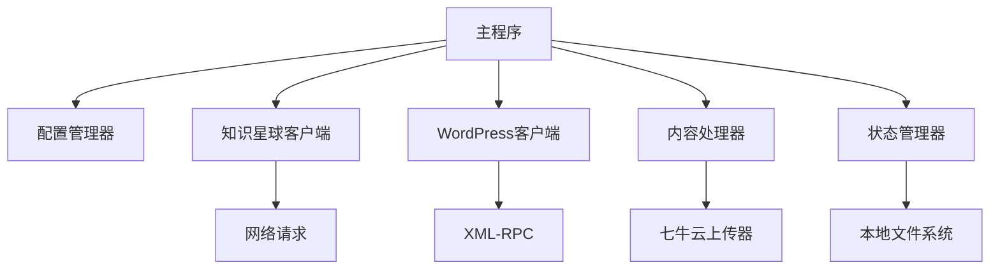

# 开发文档

知识星球到WordPress同步工具的开发指南和贡献说明。

## 目录

- [开发环境设置](#开发环境设置)
- [项目架构](#项目架构)
- [编码规范](#编码规范)
- [测试指南](#测试指南)
- [贡献流程](#贡献流程)
- [发布流程](#发布流程)
- [性能优化](#性能优化)

## 开发环境设置

### 环境要求

- **Python**: 3.8+
- **Git**: 最新版本
- **编辑器**: VS Code（推荐）或PyCharm

### 初始化开发环境

```bash
# 克隆项目
git clone https://github.com/your-username/ZSXQToWordpress.git
cd ZSXQToWordpress

# 创建虚拟环境
python3 -m venv venv
source venv/bin/activate  # Linux/macOS
# venv\Scripts\activate  # Windows

# 安装开发依赖
pip install -r requirements.txt
pip install -r requirements-dev.txt  # 开发专用依赖

# 安装pre-commit钩子
pre-commit install
```

### VS Code配置

推荐的 `.vscode/settings.json` 配置：

```json
{
    "python.defaultInterpreterPath": "./venv/bin/python",
    "python.linting.enabled": true,
    "python.linting.pylintEnabled": true,
    "python.linting.flake8Enabled": true,
    "python.formatting.provider": "black",
    "python.sortImports.args": ["--profile", "black"],
    "editor.formatOnSave": true,
    "editor.codeActionsOnSave": {
        "source.organizeImports": true
    }
}
```

## 项目架构

### 目录结构

```
ZSXQToWordpress/
├── docs/                    # 文档目录
│   ├── api/                 # API文档
│   ├── deployment/          # 部署文档
│   ├── development/         # 开发文档
│   ├── security/            # 安全文档
│   └── troubleshooting/     # 故障排除文档
├── tests/                   # 测试文件
├── UI/UX/                   # 界面原型
├── interfaces.py            # 接口定义
├── config_manager.py        # 配置管理
├── zsxq_client.py          # 知识星球客户端
├── wordpress_client.py      # WordPress客户端
├── qiniu_uploader.py       # 七牛云上传器
├── content_processor.py    # 内容处理器
├── sync_state.py           # 状态管理
├── log_utils.py            # 日志工具
├── zsxq_to_wordpress.py    # 主程序
└── requirements.txt        # 依赖列表
```

### 架构设计原则

1. **接口抽象**: 使用ABC定义接口，便于扩展和测试
2. **单一职责**: 每个模块专注于特定功能
3. **依赖注入**: 通过构造函数注入依赖
4. **错误处理**: 统一的异常处理机制
5. **日志记录**: 完整的日志追踪

### 核心组件交互



## 编码规范

### Python代码规范

遵循PEP 8规范，使用以下工具：

- **Black**: 代码格式化
- **isort**: import排序
- **flake8**: 代码检查
- **pylint**: 代码质量检查

### 命名规范

```python
# 类名：大驼峰
class ContentProcessor:
    pass

# 函数名/变量名：下划线分隔
def process_content(raw_content):
    processed_data = {}
    return processed_data

# 常量：全大写
MAX_RETRY_COUNT = 5
DEFAULT_BATCH_SIZE = 20

# 私有方法：前缀下划线
def _internal_method(self):
    pass
```

### 文档字符串规范

```python
def get_content(self, content_id: str) -> Dict[str, Any]:
    """获取单个内容
    
    Args:
        content_id (str): 内容ID
        
    Returns:
        Dict[str, Any]: 内容数据
        
    Raises:
        ZsxqAPIError: 当API调用失败时
        
    Example:
        >>> client = ZsxqClient(...)
        >>> content = client.get_content("12345")
        >>> print(content['title'])
    """
    pass
```

### 类型提示

项目强制使用类型提示：

```python
from typing import Dict, List, Optional, Union, Any

def process_topics(
    topics: List[Dict[str, Any]], 
    config: Optional[Dict[str, str]] = None
) -> Union[int, None]:
    """处理主题列表"""
    return len(topics)
```

## 测试指南

### 测试结构

```
tests/
├── __init__.py
├── conftest.py              # pytest配置和fixtures
├── unit/                    # 单元测试
│   ├── test_config_manager.py
│   ├── test_zsxq_client.py
│   ├── test_wordpress_client.py
│   └── test_content_processor.py
├── integration/             # 集成测试
│   ├── test_sync_workflow.py
│   └── test_api_integration.py
└── fixtures/                # 测试数据
    ├── sample_config.json
    └── sample_topics.json
```

### 编写测试

```python
import pytest
from unittest.mock import Mock, patch
from zsxq_client import ZsxqClient, ZsxqAPIError

class TestZsxqClient:
    @pytest.fixture
    def client(self):
        return ZsxqClient(
            access_token="test_token",
            user_agent="test_agent",
            group_id="test_group"
        )
    
    @patch('zsxq_client.requests.Session.request')
    def test_get_topics_success(self, mock_request, client):
        # 设置mock响应
        mock_response = Mock()
        mock_response.status_code = 200
        mock_response.json.return_value = {
            'succeeded': True,
            'resp_data': {'topics': [{'topic_id': '123'}]}
        }
        mock_request.return_value = mock_response
        
        # 执行测试
        topics = client.get_topics(count=1)
        
        # 验证结果
        assert len(topics) == 1
        assert topics[0]['topic_id'] == '123'
        mock_request.assert_called_once()
    
    @patch('zsxq_client.requests.Session.request')
    def test_get_topics_api_error(self, mock_request, client):
        # 设置mock错误响应
        mock_response = Mock()
        mock_response.status_code = 401
        mock_request.return_value = mock_response
        
        # 验证异常
        with pytest.raises(ZsxqAPIError):
            client.get_topics()
```

### 运行测试

```bash
# 运行所有测试
pytest

# 运行特定测试文件
pytest tests/unit/test_zsxq_client.py

# 运行特定测试方法
pytest tests/unit/test_zsxq_client.py::TestZsxqClient::test_get_topics_success

# 生成覆盖率报告
pytest --cov=. --cov-report=html

# 运行性能测试
pytest tests/performance/ -v
```

### 测试覆盖率要求

- **总体覆盖率**: 至少80%
- **核心模块**: 至少90%
- **关键方法**: 100%

## 贡献流程

### 1. 创建Issue

在开始开发前，请先创建Issue说明：
- 要解决的问题或要添加的功能
- 实现方案和设计考虑
- 可能的影响和风险

### 2. 分支管理

```bash
# 从main分支创建功能分支
git checkout main
git pull origin main
git checkout -b feature/your-feature-name

# 或创建修复分支
git checkout -b fix/bug-description
```

### 3. 开发流程

```bash
# 编写代码
# 编写测试
# 运行测试
pytest

# 代码格式化
black .
isort .

# 代码检查
flake8
pylint *.py

# 提交代码
git add .
git commit -m "feat: 添加新功能描述"
```

### 4. 提交信息规范

使用[Conventional Commits](https://conventionalcommits.org/)规范：

- `feat:` 新功能
- `fix:` 修复bug
- `docs:` 文档更新
- `style:` 代码格式调整
- `refactor:` 重构
- `test:` 测试相关
- `chore:` 构建或辅助工具变更

### 5. 创建Pull Request

1. 推送分支到GitHub
2. 创建Pull Request
3. 填写PR模板信息
4. 等待代码审查
5. 根据反馈修改代码

### 6. 代码审查清单

- [ ] 代码遵循项目规范
- [ ] 包含必要的测试
- [ ] 测试通过
- [ ] 文档已更新
- [ ] 没有引入安全问题
- [ ] 性能影响可接受

## 发布流程

### 版本号规范

使用[语义化版本](https://semver.org/)：
- `MAJOR.MINOR.PATCH`
- 例如：`1.2.3`

### 发布步骤

1. **更新版本号**:
```bash
# 更新 __version__ 变量
echo "__version__ = '1.2.3'" > version.py
```

2. **更新CHANGELOG**:
```markdown
## [1.2.3] - 2024-01-01
### Added
- 新功能描述

### Fixed  
- 修复的问题

### Changed
- 变更内容
```

3. **创建发布分支**:
```bash
git checkout -b release/1.2.3
git add .
git commit -m "chore: 准备发布 v1.2.3"
```

4. **合并到main分支**:
```bash
git checkout main
git merge release/1.2.3
git tag v1.2.3
git push origin main --tags
```

5. **GitHub发布**:
- 在GitHub上创建Release
- 上传发布文件
- 编写Release Notes

## 性能优化

### 性能监控

```python
import time
import logging
from functools import wraps

def performance_monitor(func):
    @wraps(func)
    def wrapper(*args, **kwargs):
        start_time = time.time()
        result = func(*args, **kwargs)
        duration = time.time() - start_time
        
        logger = logging.getLogger(__name__)
        logger.info(f"{func.__name__} 执行耗时: {duration:.2f}秒")
        
        return result
    return wrapper

@performance_monitor
def sync_all_topics(self):
    # 同步逻辑
    pass
```

### 内存优化

```python
import gc
from typing import Iterator

def process_large_dataset(items: List[Any]) -> Iterator[Any]:
    """分批处理大数据集，避免内存溢出"""
    batch_size = 100
    
    for i in range(0, len(items), batch_size):
        batch = items[i:i + batch_size]
        
        for item in batch:
            yield process_item(item)
        
        # 强制垃圾回收
        del batch
        gc.collect()
```

### 并发优化

```python
import asyncio
import aiohttp
from concurrent.futures import ThreadPoolExecutor

async def async_process_topics(topics: List[Dict]):
    """异步处理主题列表"""
    semaphore = asyncio.Semaphore(5)  # 限制并发数
    
    async def process_single(topic):
        async with semaphore:
            # 处理单个主题
            return await process_topic(topic)
    
    tasks = [process_single(topic) for topic in topics]
    results = await asyncio.gather(*tasks)
    
    return results
```

## 持续集成

### GitHub Actions配置

`.github/workflows/ci.yml`:

```yaml
name: CI

on: [push, pull_request]

jobs:
  test:
    runs-on: ubuntu-latest
    strategy:
      matrix:
        python-version: [3.8, 3.9, '3.10', '3.11']
    
    steps:
    - uses: actions/checkout@v3
    
    - name: Set up Python
      uses: actions/setup-python@v4
      with:
        python-version: ${{ matrix.python-version }}
    
    - name: Install dependencies
      run: |
        pip install -r requirements.txt
        pip install -r requirements-dev.txt
    
    - name: Run tests
      run: |
        pytest --cov=. --cov-report=xml
    
    - name: Upload coverage
      uses: codecov/codecov-action@v3
```

### 代码质量检查

```yaml
  quality:
    runs-on: ubuntu-latest
    steps:
    - uses: actions/checkout@v3
    - name: Set up Python
      uses: actions/setup-python@v4
      with:
        python-version: '3.9'
    
    - name: Install dependencies
      run: pip install black flake8 pylint
    
    - name: Check code formatting
      run: black --check .
    
    - name: Check import sorting  
      run: isort --check-only .
    
    - name: Lint with flake8
      run: flake8
    
    - name: Lint with pylint
      run: pylint *.py
```

这份开发文档为项目贡献者提供了完整的开发指南，从环境设置到发布流程都有详细说明，有助于保持代码质量和开发效率。